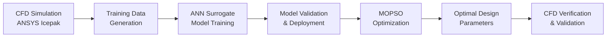

# CFD-ANN-PSO-Net

A comprehensive computational framework for engineering design optimization combining Computational Fluid Dynamics (CFD), Artificial Neural Networks (ANN), and Particle Swarm Optimization (PSO). This repository provides an end-to-end pipeline for complex system modeling, surrogate model development, and multi-objective optimization.

## Overview

CFD-ANN-PSO-Net addresses the computational challenges in engineering design optimization where traditional analytical methods prove inadequate. The framework integrates three complementary approaches:

- **CFD Modeling**: High-fidelity thermal and fluid flow simulations using ANSYS Icepak
- **ANN Surrogate Models**: Fast, accurate neural network approximations of complex physics
- **Multi-Objective PSO**: Intelligent optimization algorithms for design space exploration

This integrated approach enables efficient optimization of complex engineering systems, particularly in thermal management, electronic cooling, and multi-physics applications.

## Repository Structure

```
CFD-ANN-PSO-Net/
├── ANN_Surrogate_Optimization_Pipeline/
│   ├── ANN_Surrogate_Optimization_Pipeline.ipynb
│   ├── IJMS_HS_data.xlsx
│   └── README.md
├── Generalized_MOPSO_Framework/
│   ├── Generalized_MOPSO_Framework.ipynb
│   └── README.md
├── Optimized_Gaming_Workstation_Model/
│   ├── Optimized_Gaming_Workstation.tzr
│   └── README.md
└── README.md (this file)
```

## Core Components

### 1. ANN Surrogate Optimization Pipeline
**Location**: `ANN_Surrogate_Optimization_Pipeline/`

A comprehensive Python framework for building, training, and evaluating Artificial Neural Networks with automated hyperparameter optimization. The pipeline combines scikit-learn MLPRegressor baseline models with custom TensorFlow/Keras Deep Neural Networks.

**Key Features**:
- Interactive data loading (CSV, Excel, TXT formats)
- Automated hyperparameter optimization using GridSearchCV
- Dual-model architecture (MLP vs. DNN comparison)
- Advanced training protocols with multiple termination conditions
- Comprehensive validation and cross-validation analysis
- Production deployment infrastructure

**Applications**:
- Electronic cooling systems modeling
- Heat sink thermal performance prediction
- Multi-parameter optimization of cooling geometries
- Complex system characterization and surrogate model development

### 2. Generalized MOPSO Framework
**Location**: `Generalized_MOPSO_Framework/`

A sophisticated multi-objective optimization framework using Particle Swarm Optimization with pre-trained ANN models as surrogate functions. Designed for complex engineering optimization problems with multiple competing objectives.

**Key Features**:
- Multi-objective optimization with flexible objective configuration
- Advanced constraint handling with customizable penalty functions
- Intelligent parameter handling (continuous and discrete variables)
- Early termination system with convergence detection
- Comprehensive results analysis and visualization

**Applications**:
- Multi-objective design optimization
- Parameter sensitivity analysis
- Design space exploration with limited experimental data
- Real-time system parameter tuning

### 3. Optimized Gaming Workstation Model
**Location**: `Optimized_Gaming_Workstation_Model/`

A complete ANSYS Icepak thermal simulation archive for high-performance gaming workstation thermal management analysis. Provides realistic boundary conditions, material properties, and geometric representations.

**Key Features**:
- Comprehensive system component modeling (CPU, GPU, cooling systems)
- Realistic boundary conditions and material properties
- Steady-state and transient thermal analysis capabilities
- Parametric studies and design optimization support

**Applications**:
- Gaming workstation thermal design
- Component placement optimization
- Cooling system selection and configuration
- Performance analysis under various load scenarios

## Workflow Integration

The three components work together in a complete optimization pipeline:



### Step-by-Step Process:

1. **CFD Analysis**: Generate high-fidelity simulation data using the ANSYS Icepak model
2. **Data Preparation**: Process simulation results into training datasets
3. **ANN Training**: Develop accurate surrogate models using the optimization pipeline
4. **Model Validation**: Verify surrogate model accuracy and performance
5. **Multi-Objective Optimization**: Use MOPSO framework with trained surrogates
6. **Design Verification**: Validate optimal designs using original CFD models

## Installation Requirements

### Python Dependencies
```bash
pip install numpy==1.24.3 pandas==2.0.3 matplotlib==3.7.2 seaborn==0.12.2 
pip install joblib==1.2.0 tensorflow==2.15.0 tqdm==4.65.0 scikit-learn==1.5.1 
pip install openpyxl==3.0.10 pyswarm
```

### Software Requirements
- **Python 3.11+** with scientific computing packages
- **ANSYS Icepak 2023 R1+** for CFD modeling (optional, for model modification)
- **Jupyter Notebook** for interactive development

### Hardware Recommendations
- **Minimum**: 16GB RAM, multi-core processor
- **Recommended**: 32GB RAM, GPU support for TensorFlow (CUDA-compatible)
- **Storage**: 10GB+ free space for results and model storage

## Quick Start Guide

### 1. ANN Surrogate Model Development
```bash
cd ANN_Surrogate_Optimization_Pipeline/
jupyter notebook ANN_Surrogate_Optimization_Pipeline.ipynb
```

Follow the interactive notebook to:
- Load your engineering data (use provided IJMS_HS_data.xlsx as example)
- Configure model architecture and training parameters
- Train both MLP and DNN models with hyperparameter optimization
- Validate model performance and export trained models

### 2. Multi-Objective Optimization
```bash
cd Generalized_MOPSO_Framework/
jupyter notebook Generalized_MOPSO_Framework.ipynb
```

Configure and run optimization:
- Load pre-trained ANN models from previous step
- Define optimization objectives and constraints
- Set parameter bounds and types (continuous/discrete)
- Execute MOPSO optimization with early termination
- Analyze results and generate visualizations

### 3. CFD Model Usage (Optional)
```bash
# Open ANSYS Icepak
# Import Optimized_Gaming_Workstation.tzr
# Modify boundary conditions as needed
# Run thermal analysis
```

## Example Applications

### Electronic Cooling System Optimization
**Objective**: Minimize GPU temperature while minimizing cost
- **Parameters**: Fin geometry, fan speed, material selection, fin counts
- **Constraints**: Temperature limits, manufacturing constraints
- **Results**: Pareto-optimal design configurations

### Heat Sink Design Optimization
**Objective**: Maximize thermal performance with minimum weight
- **Parameters**: Fin dimensions, material properties, airflow rates
- **Constraints**: Size limitations, manufacturing feasibility
- **Results**: Optimized geometric configurations

## Advanced Features

### Neural Network Architecture
- **Dual-Model Comparison**: MLPRegressor vs. custom TensorFlow/Keras DNNs
- **Advanced Training**: PReLU activation, L2 regularization, AdamW optimizer
- **Robust Validation**: 5-fold cross-validation with overfitting detection
- **Production Deployment**: Complete model serialization and metadata tracking

### Multi-Objective Optimization
- **Flexible Framework**: Support for any number of objectives and constraints
- **Smart Parameter Handling**: Mixed continuous/discrete parameter spaces
- **Convergence Intelligence**: Automatic early termination with stagnation detection
- **Comprehensive Analysis**: Detailed feasibility and constraint violation reporting

### CFD Integration
- **Realistic Physics**: Comprehensive thermal and fluid flow modeling
- **Material Database**: Temperature-dependent properties for engineering materials
- **Validation Ready**: Mesh independence studies and energy balance verification
- **Parametric Capability**: Design of experiments and optimization support

## Performance and Scalability

### Computational Efficiency
- **Surrogate Models**: 70\% speedup over full CFD simulations
- **Parallel Processing**: Multi-core GridSearchCV optimization
- **Early Termination**: Up to 70% reduction in optimization iterations
- **Memory Optimization**: Efficient handling of large parameter spaces

### Accuracy and Reliability
- **Cross-Validation**: Statistical validation with confidence intervals
- **Model Comparison**: Systematic evaluation between competing architectures
- **Constraint Handling**: Robust penalty-based constraint enforcement
- **Results Verification**: Comprehensive output validation and error checking

## Documentation and Support

Each component includes comprehensive documentation:
- **Detailed README files** with mathematical formulations
- **Algorithm descriptions** with theoretical background
- **Usage examples** with step-by-step instructions
- **Troubleshooting guides** for common issues


### Getting Help
- Review individual README files for component-specific guidance
- Check Jupyter notebooks for interactive examples and detailed comments
- Validate installations using provided test datasets
- Consult academic literature for theoretical background
- Contact: **shaswatpathak.qm.researcher@gmail.com**

## Research Applications

This framework has been applied to:
- **Electronic cooling systems** for gaming workstations
- **Heat sink optimization** for high-performance computing
- **Multi-physics system design** with coupled heat and mass transfer
- **Real-time control system** parameter optimization

## Contributing

Contributions are welcome! Areas for enhancement include:
- Additional optimization algorithms (genetic algorithms, differential evolution)
- Extended CFD model library for different applications
- Advanced uncertainty quantification methods
- Real-time optimization capabilities

## License

This project is released under the [MIT License](LICENSE).  
It is provided primarily for **educational and research purposes**. Users are responsible for validating results against experimental data for their specific applications.  

 **Commercial use requires appropriate software licensing for ANSYS products.**  

If you use this code or framework in your research, **please provide proper citation** to acknowledge the author and repository. Citation helps support further development and ensures credit is given to the original work.

## Citation

---

If you use this code, methodology, or dataset in your research, please cite the following work:  

**Shaswat Pathak, Aayush Luitel, Amjad Ali Pasha, D. Siva Krishna Reddy, Salem Algarni, Talal Alqahtani, Kashif Irshad.** "ML–augmented CFD–framework for heat-sink and fan-speed optimization in gaming workstation." *International Journal of Mechanical Sciences*, 2025, 110752. [https://doi.org/10.1016/j.ijmecsci.2025.110752](https://doi.org/10.1016/j.ijmecsci.2025.110752)

---

**BibTeX format for citation:**  

```bibtex
@article{PATHAK2025110752,
  title = {ML–augmented CFD–framework for heat-sink and fan-speed optimization in gaming workstation},
  journal = {International Journal of Mechanical Sciences},
  pages = {110752},
  year = {2025},
  issn = {0020-7403},
  doi = {https://doi.org/10.1016/j.ijmecsci.2025.110752},
  url = {https://www.sciencedirect.com/science/article/pii/S0020740325008343},
  author = {Shaswat Pathak and Aayush Luitel and Amjad Ali Pasha and D. Siva Krishna Reddy and Salem Algarni and Talal Alqahtani and Kashif Irshad}
}
